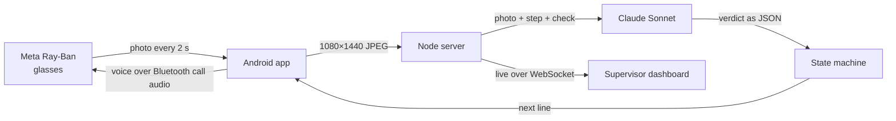

# BASIC

**Smart glasses that teach you to install a home battery.**

You put on a pair of Meta Ray-Ban glasses and walk up to a Base Power battery. A calm voice in your ear tells you the first step. The glasses camera watches your hands, and when you get it right the voice confirms it and gives you the next step. When you get it wrong, it tells you exactly what to fix. Nobody has to stand next to you, because a master electrician is watching every crew at once from a dashboard and can talk into anyone's glasses by typing.

Built for Base Power's install crews at the Base Power x AITX hackathon, Austin, September 2026.

## Quick start

```bash
git clone https://github.com/sisiphamus/BASIC.git && cd BASIC
npm install
npm run build
cp env.example .env     # MODEL_PROVIDER=claude-cli by default
npm start               # dashboard at http://localhost:3000
```

No model set up yet? `MODEL_PROVIDER=mock npm start` runs a built-in walkthrough model that fakes believable results, and `npm run simulate -- --crews 3 --loop` fills the dashboard with simulated crews.

## What it sounds like

From a real run on a real battery. Only the first line of each step is written in advance. Claude wrote everything else from the photo it was looking at.

> **BASIC:** Lower the metal shell over the gray top until it sits flush.<br>
> **BASIC:** Place a hand on the metal shell and give a thumbs up if flush.<br>
> **BASIC:** Metal shell is seated flush over the module stack. Confirmed.<br>
> **BASIC:** Open the installer app and press Start commissioning. Show me when it reads Online.<br>
> **BASIC:** Commissioning reads Online with all four checks passing. Well done.<br>
> **BASIC:** Grid test. In the installer app, drag the grid breaker down to OFF.<br>
> **BASIC:** Grid breaker reads OFF and the home is islanded on battery. Confirmed.

## Architecture



Every two seconds the Android app pulls a full-resolution photo off the glasses camera and sends it to the server. The server hands Claude the photo, the current step of the job, and the check for that step, written in plain English. Claude answers with a verdict (pass, fail or unclear), the evidence it saw, a confidence score and one short sentence for the technician. The server decides what happens next, and the phone speaks the line into the glasses.

## Under the hood

**The model sees, the code decides.** Claude never moves the job forward on its own. A small deterministic state machine does, and it only advances when Claude is at least 60% confident the step is done. If Claude is unsure four frames in a row, the tech gets a hint. If a step keeps failing, the correction repeats every 15 seconds instead of every frame.

**It always judges the newest frame.** A model call takes about five seconds, and the glasses send a photo every two. Each crew gets one call in flight at a time. While it runs, newer photos replace older ones in the queue, and an answer about a photo the tech has already moved past is thrown away. The coaching stays about what's in front of you right now.

**Your hands are the interface.** The glasses have no screen and a tech's hands are usually full, so every step ends with a hand signal: point at the studs, put a hand on the part, thumbs up. Claude reads the gesture as the tech saying "I'm done, check me."

**Jobs are text files.** Each job is a YAML playbook with the steps, the check for each one, and a paragraph of context about the site and the voice to use. A playbook is validated before it loads and reloads on save, so a supervisor can rewrite a step while someone is wearing the glasses and it applies on the next photo. We reordered the install that way in the middle of a run.

```yaml
- id: metal-shell
  title: Metal shell
  say: Lower the metal shell over the gray top until it sits flush.
  why: The metal shell is the outer housing. It goes on last, after every connection.
  check: The metal shell has been lowered over the gray top and module stack and is sitting flush.
```

**The voice works while the camera is on.** Meta's glasses mute normal media audio while the camera streams, which would have silenced the coaching. The app sends its speech over the Bluetooth phone-call channel instead, which stays open during a stream.

**Everything is logged.** Every photo is saved with its sharpness, brightness, scene change, JPEG quality and hash, alongside the exact prompt, Claude's raw answer, the token count and cost, and the decision the state machine made. `npm run console` streams it live in a terminal, and `npm run frames` shows what the glasses see in a second window.

**Measured on real hardware:** about 5 seconds and about $0.013 per check with Claude Sonnet on low effort, on 1080×1440 photos straight off a pair of Ray-Ban Meta glasses.

## Tech stack

| Layer | Tools |
|---|---|
| Glasses | Meta Wearables Device Access Toolkit 1.0 (Android) on Ray-Ban Meta |
| Phone app | Kotlin, Jetpack Compose, Android TextToSpeech, OkHttp |
| Vision model | Claude Sonnet through the Claude Code CLI. Google Gemini API as a drop-in alternative |
| Server | Node.js 22, Express 5, WebSockets (`ws`) |
| Jobs | YAML playbooks validated with Zod |
| Dashboard | React 19, Vite, Tailwind CSS 4 |
| Images | jsQR and jpeg-js for QR decoding and frame statistics |
| Tests | `node:test` (93 unit and API tests), Playwright end to end |

## Reproduce the demo

**You need:** Node.js 22 and the [Claude Code CLI](https://docs.anthropic.com/en/docs/claude-code) logged in on the laptop, or a Gemini API key instead. For the glasses you also need an Android phone, Ray-Ban Meta glasses, JDK 17 and the Android SDK.

**1. Configure.** Copy `env.example` to `.env`. With Claude there is no API key to paste: the server calls the `claude` command and uses the account it's logged into. The sample file:

```bash
MODEL_PROVIDER=claude-cli      # or gemini, or mock
# BA_CLAUDE_MODEL=sonnet
# BA_CLAUDE_EFFORT=low
# BA_CLAUDE_TIMEOUT_MS=30000
GEMINI_API_KEY=                # only for MODEL_PROVIDER=gemini
# GEMINI_MODEL=                # empty picks the newest stable flash model
# PORT=3000
# HTTPS_PORT=3443
# DATA_DIR=./data
```

| Variable | What it does | Default |
|---|---|---|
| `MODEL_PROVIDER` | `claude-cli`, `gemini` or `mock` | Gemini if a key is set, otherwise mock |
| `BA_CLAUDE_MODEL`, `BA_CLAUDE_EFFORT` | Claude model and effort level | `sonnet`, `low` |
| `BA_CLAUDE_BIN` | Path to the `claude` command | `claude` |
| `GEMINI_API_KEY`, `GEMINI_MODEL` | Gemini key and an optional model pin | none, auto |
| `PORT`, `HTTPS_PORT` | Dashboard port and phone web page port | `3000`, `3443` |
| `DATA_DIR` | Where jobs, photos and traces are saved | `./data` |

**2. Start the server.** `npm install && npm run build && npm start`. The last startup line names the model in use.

**3. Install the glasses app.** In the Meta AI app, pair the glasses and turn on Developer Mode (no Meta developer account needed). Then build and install:

```bash
cd android
./gradlew assembleDebug
adb install -r app/build/outputs/apk/debug/app-debug.apk
adb reverse tcp:3000 tcp:3000          # the phone on USB reaches the laptop at localhost:3000
```

Open BASIC on the phone, set the server to `http://localhost:3000`, tap **Connect glasses** once, pick **Base battery install (visit 2)** and press **Start**.

**4. Run the job.** Follow the 12 steps in the [demo script](docs/demo.md). Watch it live with `npm run console` (telemetry) and `npm run frames` (what the glasses see, in a kitty terminal).

No glasses? Turn on "Test without glasses" in the app, and Meta's MockDeviceKit pairs simulated glasses whose camera returns the sample photos. The [field guide](docs/field-guide.md) covers that and the phone-camera web page.

## Data

Nothing was trained. Claude and Gemini are used as they come, and every step is judged against a plain-English check written in the playbook.

- **Sample photos** (`demo-frames/`, with copies in the Android app for the simulated glasses): public photos from Wikimedia Commons under CC0, public domain and Creative Commons licenses. Every file, author and license is listed in [`demo-frames/CREDITS.md`](demo-frames/CREDITS.md).
- **Synthetic images:** the installer app status screens and the serial label were made for this project. They are not real Base Power screens or labels.
- **Job data:** the customer, address, job number and serial number in the playbooks are made up.
- **Install sequence:** based on how a Base Power installer described a visit-2 install at the hackathon, plus Base's public siting rules (footprint, clearances). It is a teaching demo, not Base's official procedure.
- **Real glasses photos** from our test runs stay on the laptop under `data/` and are not in this repo.

## Known limitations

- **About 5 seconds per check.** That's fine for step-by-step work and too slow to catch a fast mistake mid-motion.
- **It judges one photo at a time.** It can see that a part is in place, but it can't measure torque or voltage, or hear a latch click.
- **The QR code on the real battery is too small to decode** from a 1080×1440 frame, so the scan step confirms the label is in view without reading the serial.
- **The glasses drop the session when taken off.** The app restarts the camera on its own, but reconnecting sometimes takes an app restart.
- **The Disco, commissioning and grid test happen on screens inside our app,** standing in for Base's real installer app.
- **There's no login.** Anyone who can reach the server can send messages to a crew, so run it on a trusted network.
- **Tested on one setup:** a Galaxy S24 with Ray-Ban Meta glasses, Android only.

## Next steps

- Take full-resolution stills on scan steps so the serial can be read and matched to the job.
- Connect to Base's real installer app and job records in place of the stand-in screens.
- Build the iOS app on Meta's iOS toolkit.
- Add login and per-crew access before any real field use.
- Turn each tech's passed steps into a sign-off record a master electrician can approve.

## Repo

```
android/      the glasses app (Kotlin): camera loop, voice, installer app screens
server/       Express + WebSocket server, step state machine, Claude and Gemini providers
playbooks/    the jobs, one YAML file each
web/          supervisor dashboard (React) and the phone web page
scripts/      telemetry console, frame viewer, crew simulator
test/         unit, API and end-to-end tests
docs/         field guide and demo script
```

More: [field guide](docs/field-guide.md) · [demo script](docs/demo.md) · [image credits](demo-frames/CREDITS.md)
