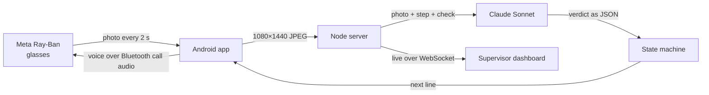

# BASIC

**Smart glasses that teach you to install a home battery.**

You put on a pair of Meta Ray-Ban glasses and walk up to a Base Power battery. A calm voice in your ear tells you the first step. The glasses camera watches your hands, and when you get it right the voice confirms it and gives you the next step. When you get it wrong, it tells you exactly what to fix. Nobody has to stand next to you, because a master electrician is watching every crew at once from a dashboard and can talk into anyone's glasses by typing.

Built for Base Power's install crews at the Base Power x AITX hackathon, Austin, September 2026.

## What it sounds like

From a real run on a real battery. Only the first line of each step is written in advance. Claude wrote everything else from the photo it was looking at.

> **BASIC:** Lower the metal shell over the gray top until it sits flush.<br>
> **BASIC:** Place a hand on the metal shell and give a thumbs up if flush.<br>
> **BASIC:** Metal shell is seated flush over the module stack. Confirmed.<br>
> **BASIC:** Open the installer app and press Start commissioning. Show me when it reads Online.<br>
> **BASIC:** Commissioning reads Online with all four checks passing. Well done.<br>
> **BASIC:** Grid test. In the installer app, drag the grid breaker down to OFF.<br>
> **BASIC:** Grid breaker reads OFF and the home is islanded on battery. Confirmed.

## How it works



Every two seconds the Android app pulls a full-resolution photo off the glasses camera and sends it to the server. The server hands Claude the photo, the current step of the job, and the check for that step, written in plain English. Claude answers with a verdict (pass, fail or unclear), the evidence it saw, a confidence score and one short sentence for the technician. The server decides what happens next, and the phone speaks the line into the glasses.

## Under the hood

**The model sees, the code decides.** Claude never moves the job forward on its own. A small deterministic state machine does, and it only advances when Claude is at least 60% confident the step is done. If Claude is unsure four frames in a row, the tech gets a hint. If a step keeps failing, the correction repeats every 15 seconds instead of every frame.

**It always judges the newest frame.** A model call takes about five seconds, and the glasses send a photo every two. Each crew gets one call in flight at a time. While it runs, newer photos replace older ones in the queue, and an answer about a photo the tech has already moved past is thrown away. The coaching stays about what's in front of you right now.

**Your hands are the interface.** The glasses have no screen and a tech's hands are usually full, so every step ends with a hand signal: point at the studs, put a hand on the part, thumbs up. Claude reads the gesture as the tech saying "I'm done, check me."

**Jobs are text files.** Each job is a YAML playbook with the steps, the check for each one, and a paragraph of context about the site and the voice to use. A playbook is validated before it loads and reloads on save, so a supervisor can rewrite a step while someone is wearing the glasses and it applies on the next photo. We reordered the install that way in the middle of a run.

```yaml
- id: metal-shell
  title: Metal shell
  say: Lower the metal shell over the gray top until it sits flush.
  why: The metal shell is the outer housing. It goes on last, after every connection.
  check: The metal shell has been lowered over the gray top and module stack and is sitting flush.
```

**The voice works while the camera is on.** Meta's glasses mute normal media audio while the camera streams, which would have silenced the coaching. The app sends its speech over the Bluetooth phone-call channel instead, which stays open during a stream.

**Everything is logged.** Every photo is saved with its sharpness, brightness, scene change, JPEG quality and hash, alongside the exact prompt, Claude's raw answer, the token count and cost, and the decision the state machine made. `npm run console` streams it live in a terminal, and `npm run frames` shows what the glasses see in a second window.

**Measured on real hardware:** about 5 seconds and about $0.013 per check with Claude Sonnet on low effort, on 1080×1440 photos straight off a pair of Ray-Ban Meta glasses.

## Built with

| Layer | Tools |
|---|---|
| Glasses | Meta Wearables Device Access Toolkit 1.0 (Android) |
| Phone app | Kotlin, Jetpack Compose, Android TextToSpeech, OkHttp |
| Vision | Claude Sonnet through the Claude Code CLI. Google Gemini API as a drop-in alternative |
| Server | Node.js 22, Express 5, WebSockets (`ws`) |
| Jobs | YAML playbooks validated with Zod |
| Dashboard | React 19, Vite, Tailwind CSS 4 |
| Images | jsQR and jpeg-js for QR decoding and frame statistics |
| Tests | `node:test` (93 unit and API tests), Playwright end to end |

## Run it

```bash
npm install
npm run build
MODEL_PROVIDER=claude-cli npm start     # uses the logged-in `claude` CLI; or set GEMINI_API_KEY in .env
```

The dashboard is at `http://localhost:3000`. With no model configured, a built-in walkthrough model fakes believable results so you can rehearse.

To use the glasses, build the Android app in `android/`, turn on Developer Mode for the glasses in the Meta AI app, and point the app at the server. The [field guide](docs/field-guide.md) walks through it, including how to run without glasses.

```bash
npm run console     # live telemetry
npm run frames      # what the glasses see (kitty terminal)
npm test
```

## Repo

```
android/      the glasses app (Kotlin): camera loop, voice, installer app screens
server/       Express + WebSocket server, step state machine, Claude and Gemini providers
playbooks/    the jobs, one YAML file each
web/          supervisor dashboard (React) and the phone web page
scripts/      telemetry console, frame viewer, crew simulator
test/         unit, API and end-to-end tests
docs/         field guide and demo script
```

More: [field guide](docs/field-guide.md) · [demo script](docs/demo.md)
