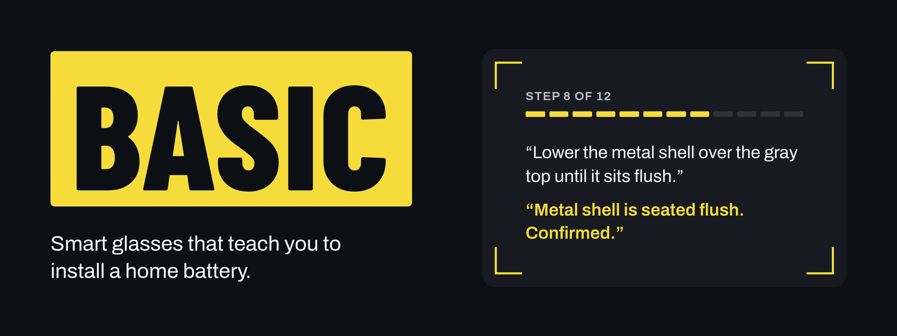
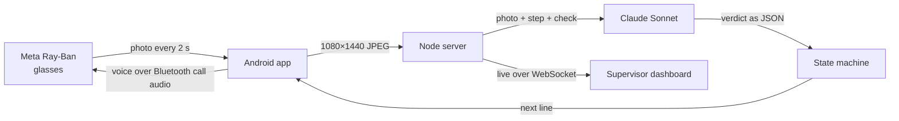

<p align="center"></p>

BASIC coaches a battery installer through Meta Ray-Ban glasses. Every two seconds the glasses camera sends a photo to Claude, which checks it against the current step of the job. A voice in the glasses confirms the step, corrects it or gives the next one. A master electrician watches every crew from one dashboard and can talk into anyone's glasses by typing.

Built for Base Power's install crews at the Base Power x AITX hackathon, Austin, September 2026.

## Quick start

```bash
git clone https://github.com/sisiphamus/BASIC.git && cd BASIC
npm install && npm run build
cp env.example .env     # MODEL_PROVIDER=claude-cli
npm start               # dashboard at http://localhost:3000
```

No model yet? `MODEL_PROVIDER=mock npm start` runs a fake model for rehearsing, and `npm run simulate -- --crews 3 --loop` fills the dashboard with simulated crews.

## Architecture



- **The model sees, the code decides.** Claude returns pass, fail or unclear with its evidence and a confidence score. A deterministic state machine only advances the job at 60% confidence or above.
- **It always judges the newest photo.** One model call runs per crew at a time, newer photos replace older ones in the queue, and answers for a step the tech has already left are thrown away.
- **Hands are the interface.** Each step ends with a gesture (point at the studs, a hand on the part, a thumbs up) that tells Claude the tech is ready to be checked.
- **Jobs are YAML playbooks.** They're validated on load and reload on save, so a step can be rewritten while someone is wearing the glasses.
- **The voice works while the camera streams.** The glasses mute media audio during a stream, so speech goes over the Bluetooth phone-call channel.
- **Everything is logged:** each photo with its quality stats, the prompt, Claude's raw answer, cost and the decision. `npm run console` streams it live.

Measured on real glasses: about 5 seconds and $0.013 per check with Claude Sonnet on low effort.

## Tech stack

| Layer | Tools |
|---|---|
| Glasses | Meta Wearables Device Access Toolkit 1.0 on Ray-Ban Meta |
| Phone app | Kotlin, Jetpack Compose, Android TextToSpeech, OkHttp |
| Vision | Claude Sonnet via the Claude Code CLI, or the Google Gemini API |
| Server | Node.js 22, Express 5, WebSockets |
| Jobs | YAML validated with Zod |
| Dashboard | React 19, Vite, Tailwind CSS 4 |
| Tests | `node:test` (93 tests), Playwright |

## Reproduce the demo

**You need** Node.js 22 and the [Claude Code CLI](https://docs.anthropic.com/en/docs/claude-code) logged in, or a Gemini API key. For the glasses you also need an Android phone, Ray-Ban Meta glasses, JDK 17 and the Android SDK.

**1. Configure** by copying `env.example` to `.env`. Claude needs no key in the file, because the server calls the logged-in `claude` command.

```bash
MODEL_PROVIDER=claude-cli      # claude-cli, gemini or mock
# BA_CLAUDE_MODEL=sonnet       # BA_CLAUDE_EFFORT=low
GEMINI_API_KEY=                # only for MODEL_PROVIDER=gemini
# PORT=3000                    # HTTPS_PORT=3443, DATA_DIR=./data
```

**2. Start the server** with `npm start`. The last startup line names the model in use.

**3. Install the glasses app.** Turn on Developer Mode for the glasses in the Meta AI app, then:

```bash
cd android && ./gradlew assembleDebug
adb install -r app/build/outputs/apk/debug/app-debug.apk
adb reverse tcp:3000 tcp:3000     # phone on USB reaches the laptop
```

Open BASIC, set the server to `http://localhost:3000`, tap **Connect glasses** once, pick **Base battery install (visit 2)** and press **Start**.

**4. Run the 12 steps** in the [demo script](docs/demo.md). No glasses? Turn on "Test without glasses" and Meta's MockDeviceKit supplies simulated ones.

## Data

Nothing was trained. Every step is judged against a plain-English check written in the playbook.

- **Sample photos** come from Wikimedia Commons (CC0, public domain and CC licenses), each credited in [`demo-frames/CREDITS.md`](demo-frames/CREDITS.md).
- **Synthetic:** the installer app screens, the serial label, and the customer and job details are made up for the demo.
- **Install sequence** is based on a Base Power installer's description at the hackathon. It is a teaching demo, not Base's official procedure.
- **Real glasses photos** from our runs stay local in `data/` and are not in the repo.

## Known limitations

- About 5 seconds per check: fine for step-by-step work, too slow to catch a fast slip.
- It judges single photos, so it can't measure torque or voltage.
- The QR code on the real battery is too small to read at 1080×1440, so the scan step only confirms the label is in view.
- The glasses drop the session when taken off, and reconnecting sometimes takes an app restart.
- There's no login, so run it on a trusted network. Tested only on a Galaxy S24 with Ray-Ban Meta.

## Next steps

- Full-resolution stills on scan steps, to read the serial and match it to the job.
- Plug into Base's real installer app and job records.
- An iOS app, plus login and per-crew access.
- Turn passed steps into sign-off records a master electrician approves.

---

[Field guide](docs/field-guide.md) · [Demo script](docs/demo.md) · [Image credits](demo-frames/CREDITS.md)
